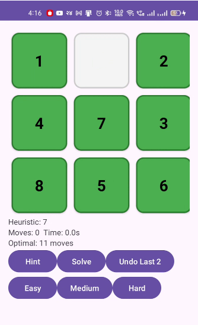
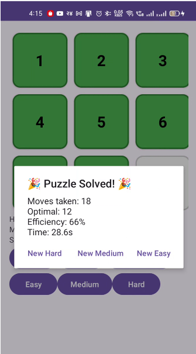

#  8 Puzzle AI Solver (Android)

An Android application that solves the classic **8 Puzzle Problem** using the **A* (A-Star) Search Algorithm**.  
The game allows users to play the puzzle manually or let the AI automatically solve it.

---

## 📱 App Screenshots

<table>
<tr>
<td align="center">
 
<b>Puzzle Interface</b>
</td>

<td align="center">
 
<b>Puzzle Solved Screen</b>
</td>
</tr>
</table>

---

##  Artificial Intelligence Algorithm

This project uses the **A* (A-Star) Search Algorithm** to find the optimal solution.

### A* Evaluation Function
f(n) = g(n) + h(n)

Where:

- **g(n)** = Cost from start node to current node  
- **h(n)** = Heuristic estimate to goal  

### Heuristic Used
**Manhattan Distance**

The Manhattan distance calculates how far each tile is from its correct position.

---

##  Example Puzzle

### Initial State
- It depends on the random pick. 
### Goal State
1 2 3
4 5 6
7 8 0

Here **0 represents the empty tile**.

---

##  Features

- Interactive 3×3 puzzle board  
- AI solver using A* algorithm  
- Hint system  
- Undo last moves  
- Move counter and timer  
- Efficiency calculation  
- Difficulty levels (Easy / Medium / Hard)

---

## Technologies Used

- **Kotlin**
- **Android Studio**
- **Artificial Intelligence (AI) Search Algorithms**

---

##  Project Structure
- Board.kt -> Puzzle board representation
- Solver.kt -> A* algorithm implementation
- MainActivity.kt -> Android UI and controls

---

##  How to Run the Project

1. Clone the repository

2. Open the project in **Android Studio**

3. Sync Gradle

4. Run the app on an **Android emulator or physical device**

---

##  Author

**Santosh Sah**  
**23053926**
B.Tech Computer Engineering  
KIIT University
## If you like this project, consider giving it a star ⭐ on GitHub!
